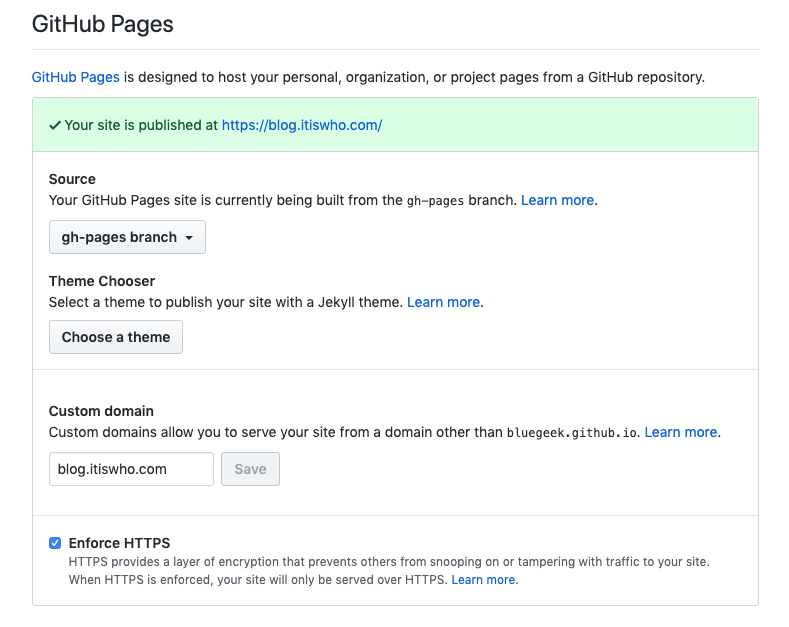

[[toc]]

# 发布
- [部署脚本](https://github.com/bluegeek/blog/blob/master/deploy.sh)
- [vuepress说明](https://github.com/bluegeek/blog/blob/master/deploy.sh)

# CNAME

### GIthub：Settings->Options

### 域名解析
添加一个CNAME记录，值为bluegeek.github.io

